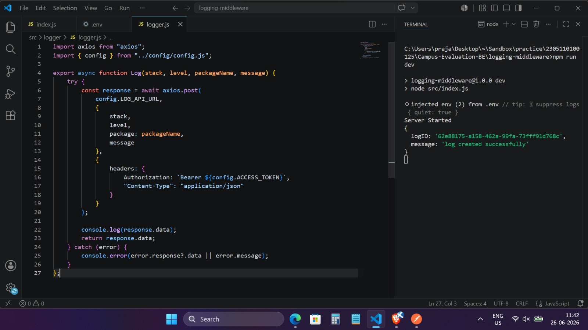
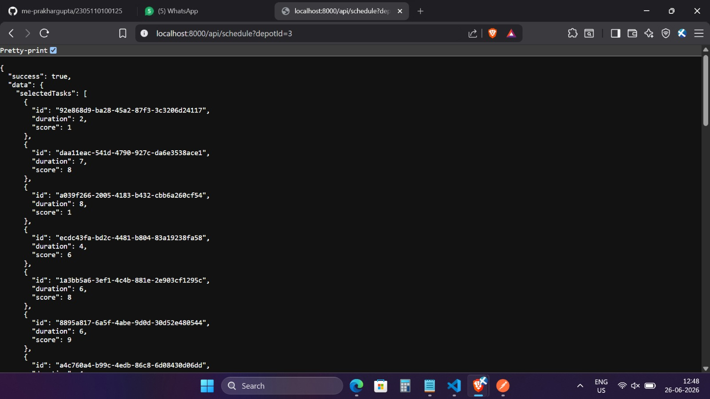

# Vehicle Maintenance Scheduler Microservice

## Overview

The **Vehicle Maintenance Scheduler Microservice** is a Node.js and Express.js based backend application developed as part of a backend evaluation. The service integrates with external Depot and Vehicle APIs to generate an optimized vehicle maintenance schedule.

The scheduling logic is implemented using the **0/1 Knapsack Dynamic Programming Algorithm**, which selects the combination of maintenance tasks that maximizes the overall operational impact while ensuring the total mechanic hours do not exceed the available budget for a selected depot.

---

## Features

* RESTful API built with Express.js
* ES Modules (`import` / `export`)
* External API integration using Axios
* Environment-based configuration
* 0/1 Knapsack Algorithm for optimization
* Modular project architecture
* Basic error handling and request validation

---

## Tech Stack

* Node.js
* Express.js
* Axios
* JavaScript (ES Modules)

---

## Project Structure

```text
src
├── algorithms
│   └── knapsack.js
│
├── config
│   └── api.js
│
├── constants
│   └── endpoints.js
│
├── controllers
│   └── scheduler.controller.js
│
├── routes
│   └── scheduler.routes.js
│
├── services
│   ├── depot.service.js
│   └── scheduler.service.js
│
├── app.js
└── index.js
```

---

## Installation

Clone the repository

```bash
git clone <repository-url>
```

Navigate to the project

```bash
cd vehicle-scheduler-be
```

Install dependencies

```bash
npm install
```

---

## Environment Variables

Create a `.env` file in the project root.

```env
PORT=8000
BASE_URL=http://4.224.186.213/evaluation-service
ACCESS_TOKEN=YOUR_ACCESS_TOKEN
```

---

## Running the Project

Start the development server:

```bash
npm run dev
```

The server will start on:

```text
http://localhost:8000
```

---

## API Endpoint

### Generate Optimized Vehicle Schedule

**Method**

```http
GET /api/schedule?depotId=<depot-id>
```

### Example Request

```http
GET http://localhost:8000/api/schedule?depotId=3
```

### Example Response

```json
{
  "success": true,
  "data": {
    "selectedTasks": [
      {
        "id": "92e868d9-ba28-45a2-87f3-3c3206d24117",
        "duration": 2,
        "score": 1
      }
    ]
  }
}
```

---

## Scheduling Workflow

1. Fetch the list of depots from the external Depot API.
2. Fetch all available maintenance tasks from the Vehicle API.
3. Retrieve the available mechanic-hour budget for the selected depot.
4. Convert the vehicle data into the format required by the scheduling algorithm.
5. Execute the **0/1 Knapsack Algorithm** to maximize the operational impact while remaining within the available mechanic-hour limit.
6. Return the optimized maintenance schedule as a JSON response.

---

## Error Handling

The application handles common scenarios such as:

* Invalid request parameters
* Depot not found
* Unauthorized API requests
* External API failures
* Internal server errors

---

## Screenshots

### Logging Middleware Output

```md

```

### Vehicle Scheduler Response

```md

```

---

## Future Improvements

* Unit testing (Jest)
* Integration testing
* API documentation using Swagger/OpenAPI
* Docker support
* CI/CD pipeline
* Response caching for external API calls

---

## Author

**Prakhar Gupta**

Backend Developer | MERN Stack Developer